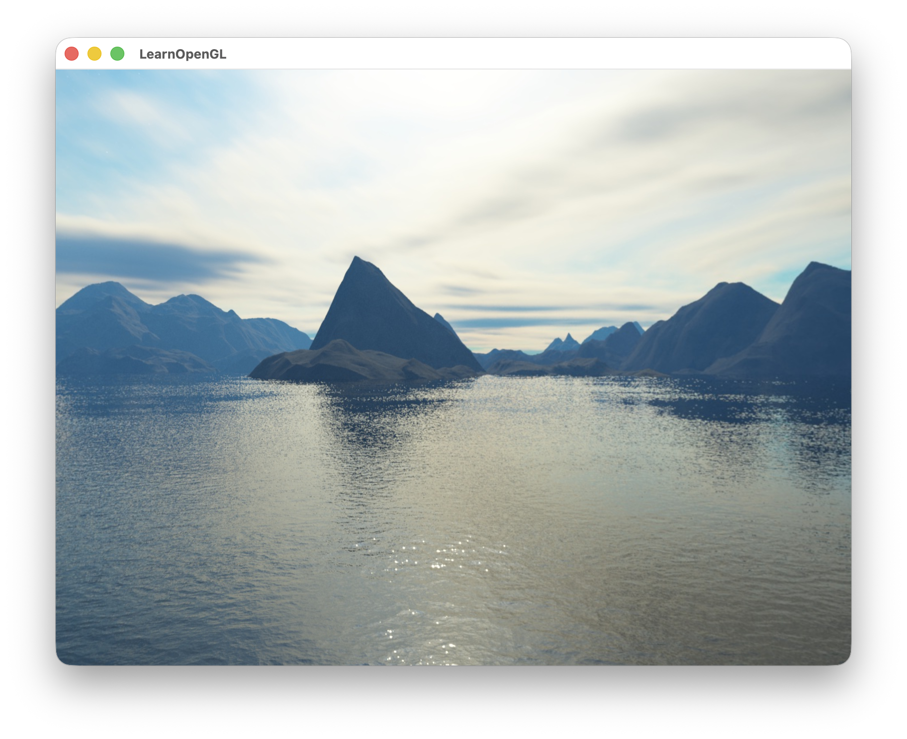

# 🧰 OpenGL®-Starter
**OpenGL®-Starter** 是一是一个为 OpenGL 项目开发提供的轻量级启动模板，基于[LearnOpenGL.com](https://learnopengl.com/)的基础 “Hello World” 示例构建，旨在帮助你快速搭建并运行 OpenGL 开发环境.目前模板已实现基础的 **Skybox（天空盒）** 渲染效果.


## 🧩 Setup

在终端中执行以下命令以获取并构建项目：

```bash
git clone --recurse-submodules https://github.com/Yanyilucas/OpenGL-Starter.git
cd OpenGL-Starter
```
```bash
mkdir build && cd build
cmake ..
make -j
```


编译完成后，在终端中运行：

```bash
./OpenGLStarter
```

该命令将启动编译生成的可执行文件，并打开一个 OpenGL 窗口，展示模板项目的默认渲染效果。

当前版本实现了基础的 **Skybox（天空盒）**，运行后你将看到如图所示的渲染结果：



## ⚙️ Requirements

此模板需要以下工具与依赖环境

 - [GNU](https://gcc.gnu.org/) / [MinGW](https://www.mingw-w64.org/) / [CLang](https://clang.llvm.org/) or [Visual Studio 2017 Build Tools(or Greater)](https://visualstudio.microsoft.com/downloads/?q=build%20tools) - Compiler
 - [GPU with minimum support for OpenGL® 3.3](https://support.pix4d.com/hc/en-us/articles/203876689-How-to-verify-the-supported-OpenGL-versions-of-the-graphics-card)
 - [CMake](https://cmake.org/) - Minimum Version 3.20.0
 - [GLFW](https://www.glfw.org/) - Already in the Repo as a SubModule *(Window and input management library)*
 - [GLAD](https://glad.dav1d.de/) - Already in the Repo as a SubModule *(OpenGL function loader, version 4.1 included)* 
 - [stb](https://github.com/nothings/stb) - Already in the Repo as a SubModule *(Lightweight image loading library)*


## 💡 Contributing

欢迎提交 Pull Request！

对于较大的改动，请先通过 Issue 讨论修改方案，以确保项目结构一致性.

本项目基于个人学习与实践整理，代码与实现可能存在不足或疏漏，欢迎提出建议与改进.


## 📄 License and Attributions

你可以自由地将本仓库作为任何 OpenGL 项目的基础，无需进行署名或引用

本项目参考并基于 [OpenGL-Starter ](https://github.com/kushagra10025/OpenGL-Starter)的工作

Repository License - [The MIT License](https://github.com/Yanyilucas/OpenGL-Starter/blob/main/LICENSE)

_OpenGL® and the oval logo are trademarks or registered trademarks of Hewlett Packard Enterprise in the United States and/or other countries worldwide._